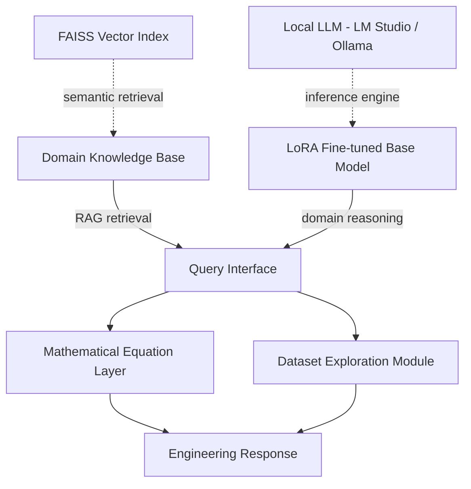

Most AI assistants are generalists. Ask them about Butler-Volmer kinetics, the difference between SEI growth mechanisms in NMC versus LFP, or how to interpret a GITT pulse sequence - and they will give you something plausible, occasionally correct, and impossible to trust without cross-checking.

That is a fundamental problem for engineering work. A tool you cannot trust at the domain boundary is a liability, not an asset. The Battery Expert AI was built to close that gap - a domain-specific assistant that understands battery electrochemistry deeply enough to be genuinely useful, and runs entirely on-premise so that proprietary cell data and OEM specifications never leave the building.

---

## Why Local, Why Domain-Specific

Two constraints drove the design.

**The GDPR constraint.** In the German automotive context, sending engineering data - cell characterisation results, electrochemical model parameters, OEM specifications - to external APIs is not an option. The tools have to run on-premise. This pushed the stack toward local LLMs (LM Studio + Ollama) and local embedding/retrieval (FAISS), which in turn pushed toward smaller, more specialised models rather than large general-purpose ones.

**The domain depth problem.** General-purpose LLMs know electrochemistry exists. They do not know it well enough to reason about degradation mechanisms, interpret partial differential equations from a battery model specification, or distinguish between the physical assumptions of SPM and DFN. That gap is the difference between a tool that speeds up work and one that introduces subtle errors into it.

The response was a hybrid architecture: a fine-tuned base model that has been adapted to battery domain vocabulary and reasoning patterns, augmented by RAG over a curated knowledge base of electrochemistry papers, standards, and internal technical documents.

---

## The Architecture

### LoRA Fine-Tuning + RAG

The system combines two techniques that address different failure modes.

**LoRA fine-tuning** adapts the base model's weights to battery domain vocabulary, equation formats, and reasoning patterns. It handles the structural knowledge - the things that are always true regardless of what document is loaded: how diffusion equations work, what Butler-Volmer describes, how SoH and SoC relate. Fine-tuning on a curated battery domain corpus means the model does not need to be re-taught fundamentals on every query.

**Multi-domain RAG** handles the specific and the current - cell characterisation data, specific standards, project documents, recent papers. The retrieval layer identifies relevant chunks from the knowledge base and injects them as context. This is where domain-specific details come from, without baking them into the model weights permanently.

The combination means the model reasons correctly about battery physics (fine-tuning) while drawing on specific, up-to-date, project-relevant information (RAG). Neither alone is sufficient.

### Mathematical Equation Handling

Battery engineering runs on differential equations. Any system that cannot handle them is decorative, not useful.

The system includes a dedicated mathematical processing layer that handles the equation types that appear throughout battery literature: coupled PDEs (the DFN model's solid and liquid phase diffusion equations), integral forms (charge and energy calculations), Arrhenius temperature dependences, Butler-Volmer kinetics, and LaTeX-formatted expressions from papers.

This is not cosmetic. When an engineer uploads a paper with an electrochemical model specification, the system needs to extract the governing equations, identify the parameters, and reason about what they imply - not just quote the text around them.

### Multi-Domain Knowledge Base

Battery engineering is cross-domain by nature. A thermal runaway analysis involves electrochemistry, thermal dynamics, and materials science simultaneously. The knowledge base is structured accordingly, covering: battery technology and electrochemistry, finite element methods for coupled multi-physics simulation, EV powertrain integration, power systems, materials science for electrode and electrolyte characterisation, and thermal management systems.

Domain-aware retrieval means queries about charging behaviour pull from the electrochemistry and EV integration domains, while queries about cooling strategies pull from thermal management and materials science. The system does not flatten everything into a single undifferentiated text corpus.

### Dataset Exploration for Battery Test Data

Battery characterisation produces structured datasets - HPPC pulses, capacity tests across temperature, impedance spectra, cycling data. The system includes a battery-specific dataset exploration module that handles CSV and MAT files directly: automated insights on capacity fade curves, resistance growth trends, temperature dependence of key parameters.

This is the connection between measured data and the simulation models that consume it. An engineer can load a characterisation dataset and ask the system to identify the key parameters needed for an ECM fit, or check whether the measured capacity fade is consistent with a SEI growth model - without leaving the tool.

---

## What This Is Not

This is not a general-purpose assistant with a battery-themed system prompt. The domain specificity comes from the training adaptation and the knowledge base structure, not from injecting "you are a battery expert" into the context.

It is also not a replacement for simulation tools. It does not run electrochemical models or produce validated simulation outputs. It is a reasoning layer - a technical interlocutor that understands what you are working on, can locate relevant prior work, can interpret model specifications and measurement data, and can surface the right questions. The simulation tools do the computation; this system helps the engineer think around the problem.

---

## Connection to the Broader Toolchain

This system sits alongside the [Codebase Indexer](/work/projects/codebase-indexer/) and [Hybrid Code Analyzer](/work/projects/hybrid-code-analyzer/) as part of the local AI stack. The shared infrastructure - local LLM serving, FAISS retrieval, document ingestion pipeline - is common across all three.

The Battery Expert AI is the domain-specific front end. The code intelligence tools are the workflow front end. Both run on the same on-premise stack, making them usable in combination: engineering reasoning about a battery simulation model (Battery Expert AI) and structural reasoning about the codebase implementing it (Codebase Indexer).

[← AI Systems Overview](/work/projects/ai-systems/) | [Work →](/work/)
