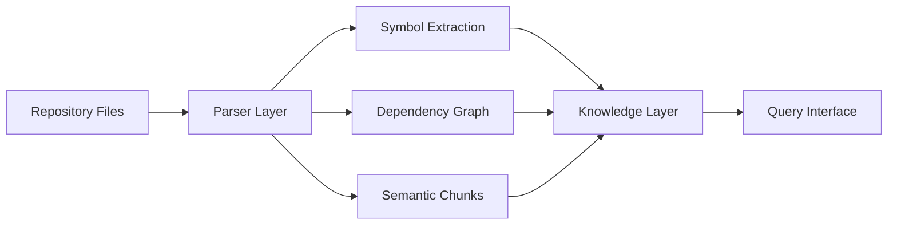

AI coding systems frequently lack persistent structural understanding of repositories. They can generate code. They struggle to reason about a codebase they didn't write.

This project built a system that gives a local LLM a structural map of any Python repository — before it touches a single line of code.

---

## The Problem

Large codebases are opaque. You can read files sequentially, but you can't reason about dependency structure, identify which modules are most central, or understand what a change to one function propagates to — not without analysis tooling.

An agent without this context makes locally-correct edits that break things three layers up. It's not a generation problem. It's a comprehension problem.

---

## Architecture

**What the system builds:**
- **Symbol maps** — every function, class, and module extracted and cross-referenced
- **Dependency graphs** — what imports what, what calls what, which modules are most connected
- **Importance scoring** — centrality-based ranking of which components matter most
- **Semantic retrieval layer** — FAISS-based vector search over code chunks for natural language queries
- **Repository memory** — persistent index that survives between agent sessions

---

## Why This Matters for Agents

An agent with access to a structural index can form a plan before touching code. It can:
- Identify the right entry point for a task
- Understand the blast radius of a proposed change
- Avoid edits that look locally correct but break something upstream

This is the difference between an agent that generates and an agent that understands. The index doesn't replace the LLM — it gives it better information to reason from.

**Runs on local LLMs (LM Studio)** — no data leaves the machine. Relevant for GDPR-constrained engineering environments where sending codebase context to external APIs is not an option.

---

## GitHub

[→ ash3spho3nix/Codebase_Indexer](https://github.com/ash3spho3nix/Codebase_Indexer)
