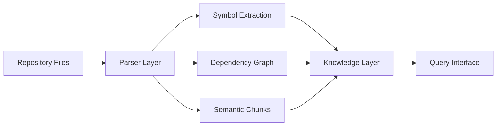

AI coding systems frequently lack persistent structural understanding of repositories. They can generate code. They struggle to reason about a codebase they didn't write.

This project built a system that gives a local LLM a structural map of any Python repository - before it touches a single line of code.

---

## The Problem

Large codebases are opaque. You can read files sequentially, but you can't reason about dependency structure, identify which modules are most central, or understand what a change to one function propagates to - not without analysis tooling.

An agent without this context makes locally-correct edits that break things three layers up. It's not a generation problem. It's a comprehension problem.

---

## Architecture

**What the system builds:**
- **Symbol maps** - every function, class, and module extracted and cross-referenced
- **Dependency graphs** - what imports what, what calls what, which modules are most connected
- **Importance scoring** - centrality-based ranking of which components matter most
- **Semantic retrieval layer** - FAISS-based vector search over code chunks for natural language queries
- **Repository memory** - persistent index that survives between agent sessions

---

## Why This Matters for Agents

An agent with access to a structural index can form a plan before touching code. It can:
- Identify the right entry point for a task
- Understand the blast radius of a proposed change
- Avoid edits that look locally correct but break something upstream

This is the difference between an agent that generates and an agent that understands. The index doesn't replace the LLM - it gives it better information to reason from.

**Runs on local LLMs (LM Studio)** - no data leaves the machine. Relevant for GDPR-constrained engineering environments where sending codebase context to external APIs is not an option.

---

## What Made This Hard

**The importance scoring problem.** Centrality in a dependency
graph is not the same as importance to a developer. A utility
module imported by 40 files is central but not necessarily the
most important thing to understand before making a change. Getting
the scoring to reflect semantic importance - not just graph
topology - required combining betweenness centrality with
call-frequency weighting and explicit handling of interface modules.

**Keeping the index current without full re-indexing.** A codebase
changes continuously. Re-running full static analysis on every
file change is expensive. The indexer uses incremental updates -
detecting which files changed, re-parsing only those, and
propagating dependency updates through the graph rather than
rebuilding from scratch.

**Context budget management.** A local LLM has a limited context
window. The indexer's query layer has to return the right
information density: enough structural context to reason about the
task, not so much that it crowds out the actual code the agent
needs to read. This is a retrieval design problem, not a parsing
problem.

## In Use

The Codebase Indexer is the pre-flight check before any AI agent
touches a repository. It feeds the [Hybrid Code Analyzer](/work/projects/hybrid-code-analyzer/)
for correlation between structural importance and runtime failures.
Both run on local LLMs via LM Studio - no data leaves the machine,
which is a hard requirement in GDPR-constrained environments.

---

## Connects To

*Thinking: [AI as Reasoning Infrastructure](/thinking/how-i-think/#ai-as-reasoning-infrastructure)*
*Project: [Hybrid Code Analyzer](/work/projects/hybrid-code-analyzer/)*
*Project: [AI-Assisted Simulation Debugger](/work/projects/ai-simulation-debugger/)*

---

## GitHub

[→ ash3spho3nix/Codebase_Indexer](https://github.com/ash3spho3nix/Codebase_Indexer)
