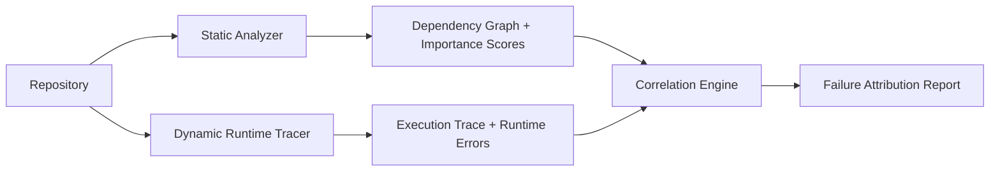

---
title: "Hybrid Code Analyzer: Finding What Static and Dynamic Analysis Miss Alone"
date: 2026-05-09
description: "A combined static + dynamic analysis pipeline that correlates runtime failures with structural code importance - built for AI-assisted debugging workflows."
tags: [AI, Static Analysis, Dynamic Analysis, Python, Architecture]
showToc: true
draft: false
---

Modern repositories are increasingly too large and interconnected for shallow debugging workflows. Static analysis tells you about structure. Dynamic analysis tells you what happens at runtime. Neither alone tells you *why* a structurally important module is failing.

This project combined both.

---

## The Core Idea

Traditional debugging tools answer: *"What failed?"*

This system attempts to answer: *"What structurally important subsystem is most likely responsible for failure propagation?"*

That's a different question. And it requires correlating two information streams that are usually kept separate.

---

## Architecture

**Static layer:** AST-level analysis - symbol extraction, import chains, dependency graph, structural importance scoring.

**Dynamic layer:** Runtime instrumentation - which paths actually execute, what types flow through, which imports fail in the current environment, where exceptions propagate.

**Correlation:** Running both and comparing reveals what neither finds alone:
- A function that statically looks correct but fails on specific input types
- An import chain that works in dev but not in production
- A path that's never exercised by tests and contains a latent bug

---

## Key Design Decision: Kept Separate Deliberately

The Indexer and Analyzer are separate tools. Not because integration is hard - because keeping them separate preserves the ability to correlate them independently.

Static info: structural (what *could* happen). Dynamic info: behavioral (what *did* happen). The discrepancy between those two is where bugs live. Merge them into a single pass and you lose the signal.

**Runs on local LLMs** - no external API calls required. Designed for GDPR-constrained environments.

---

## What Made This Hard

**The correlation problem.** Static analysis produces a structural
map. Dynamic analysis produces an execution trace. Correlating them
is not trivial - the same function appears as a node in the
dependency graph and as a frame in the call stack, but the
identifiers don't always match cleanly across tools. Building
a reliable correlation layer required careful normalisation of
both representations.

**Choosing what to instrument.** Full runtime instrumentation of
every function in a large codebase is slow and produces too much
data to reason about. The analyzer uses selective instrumentation
guided by the static importance scores from the Codebase Indexer
- prioritising coverage of high-centrality modules where a runtime
failure would propagate furthest.

**False positive management.** Dynamic analysis on untested paths
produces errors that are latent bugs, not active failures. The
report has to distinguish between "this failed during this run"
and "this will fail under these conditions" - different engineering
responses to each.

## In Use

The Hybrid Code Analyzer is designed to run after the
[Codebase Indexer](/work/projects/codebase-indexer/) has mapped
the repository structure. The indexer provides the importance
scores; the analyzer provides the runtime behaviour. The combination
answers: *which structurally important subsystem is most likely
responsible for this failure propagating?* - a question neither
tool can answer alone.

---

## GitHub

[→ ash3spho3nix/hybrid_code_analyser](https://github.com/ash3spho3nix/hybrid_code_analyser)
